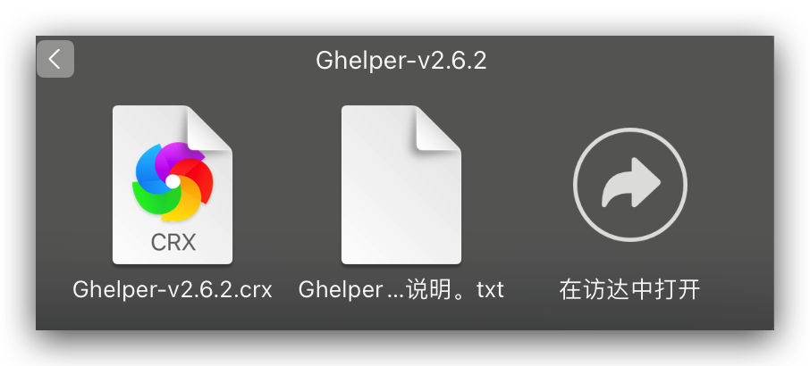

# 科学上网指南

该指南针对的是对科学上网完全无了解的人，如果你有相应的基础，可根据自己的目的选择性阅读。

## 安装 Ghelper 插件

> 经过本人测试，Ghelper 开启上网策略后似乎也不能提供一些帮助。因此，在这里建议直接用手机进入 [STC-SPADES](https://mqk4azjxg8skg6gfelpb.stcserver-cloud.com/auth/login) 或者 [谷歌云](https://scto05.xyz/auth/login) 。
> 经过测试，谷歌云的网站并没有 STC-SPADES 的稳定，但谷歌云不需要开代理就能访问，而 STC-SPADES 则可能需要开代理才能访问。
> 2022.7.11 改

在达到真正科学上网之前，我们要访问一些在国内直接访问不稳定的网站，这个插件可以提供我们部分科学上网的功能，让我们之后的访问更加容易。

在安装 Ghelper 插件之前，我们必须先安装好 [ Google Chrome 浏览器](https://www.google.com/chrome/) 或者 [Firefox 浏览器](https://www.mozilla.org/en-US/firefox/new/)。

[下载](https://pan.baidu.com/s/1FELgjPfxVPqinsz03SghrA)并解压 Ghelper 安装包。提取码为 `ih0r`。

接下来按照文件夹内提供的安装说明，安装好插件即可。

然后就是注册一个账号，登录。打开上网策略。

## 安装 Clash

打开 [链接](https://pan.baidu.com/s/1rYgf1Mjrs1Pn72tSrWwm7w?pwd=0sms)，下载并解压。

## 购买节点

节点的提供商有很多，在这里我用我正在使用的谷歌云来举例。
在浏览器中打开 [谷歌云](https://scto05.xyz/auth/register?code=vhDs)。注册账号，登录。

在购买好套餐后，在首页的订阅地址一栏，选择一键导入 Clash。

## 设为系统代理

在节点导入成功后，会看到一系列节点。

我们随意选择一个节点，然后将其设为系统代理即可。这时候我们就可以成功科学上网了。
