# 软路由使用指南

## 写在前面

本教程基于红米AX6S，其他型号的路由器若是刷入 Openwrt 固件也可以参考相应步骤。

## 进入路由器后台

在浏览器中输入 [192.168.6.1](192.168.6.1) 进入路由器后台管理界面。如下图所示：
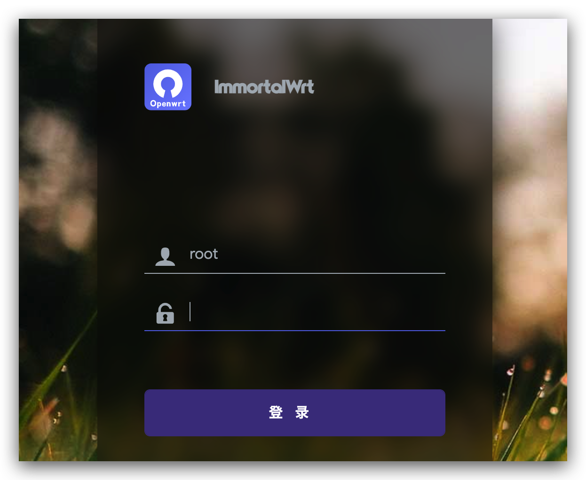

登录管理员账号，默认账号名为 `root`，密码为 `12345678`。
登录成功后会进入如下界面：
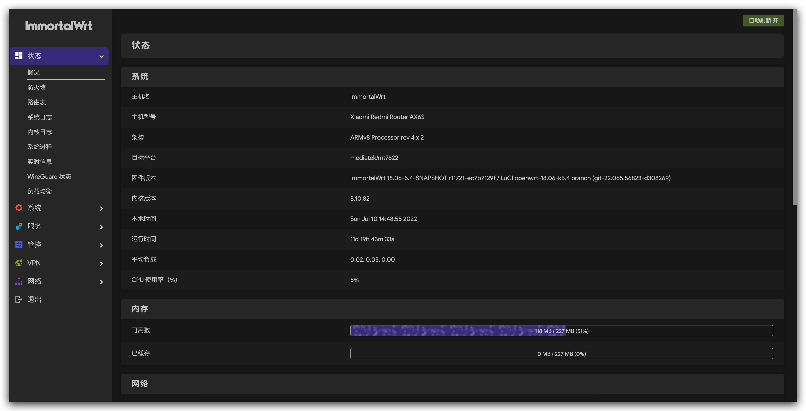

## 拨号上网

在侧边工具栏中点击 **网络** ，在其下拉栏中点击 **接口** 。
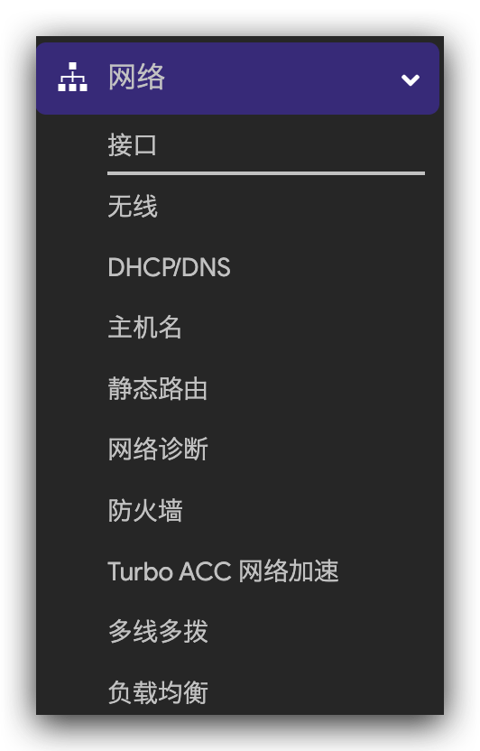

点击修改 **WAN** 接口的内容。
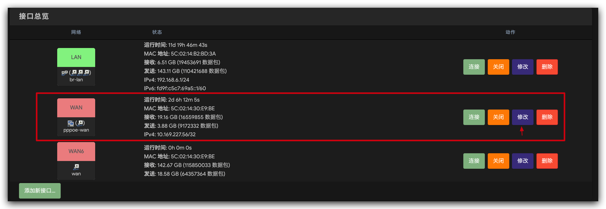

协议选择 **PPPoE** ，也就是拨号上网。
用户名和密码就是宽带的账号和密码。
其他的内容无需修改，点击保存并应用等待一段时间即可。
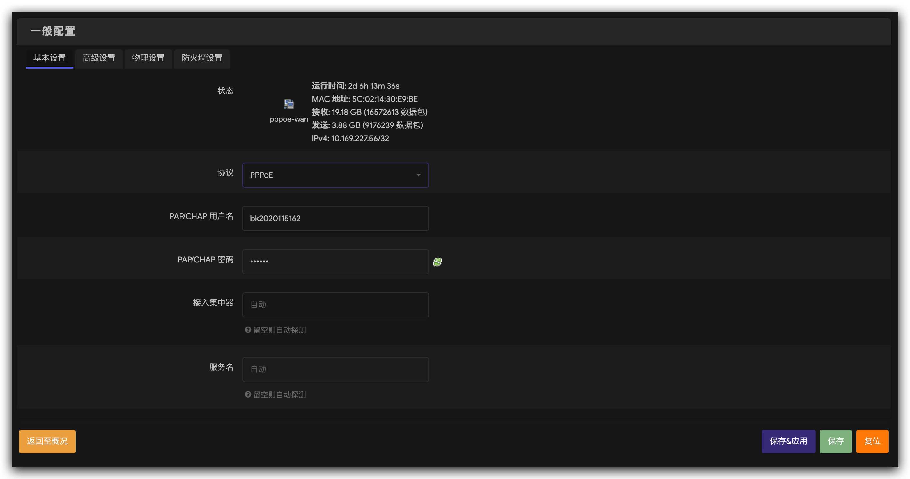

## 修改  Wi-Fi 名称

在 **网络** 的下拉栏中选择 **无线** 。
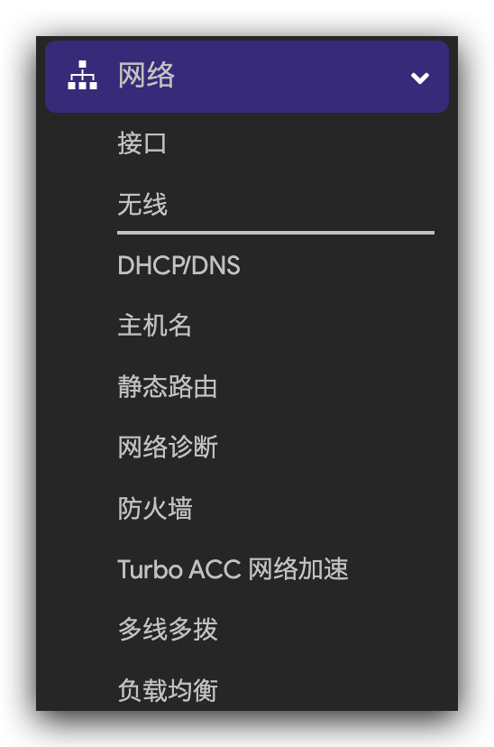

无线网络有两个频段，一个是 `2.4G`，一个是 `5G`，分别对应图中的上下两个。在这边建议使用 `5G` 频段。
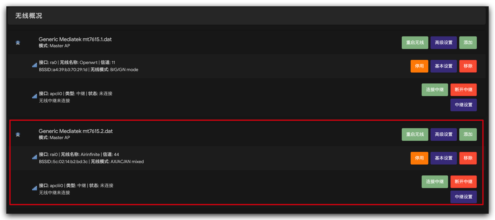

**SSID** 即为 Wi-Fi 的名称，密码根据自己需要设置。其他项与图中保持一致即可。
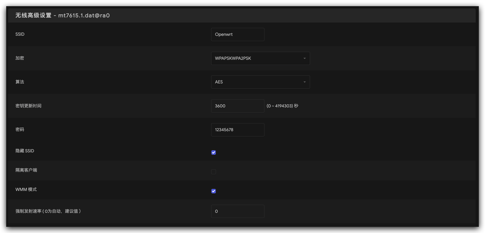
设置完成点击保存并应用，等待一段时间即会生效。

## 网络代理设置

在侧边栏中，选择 **服务** ，在其下拉栏中点击 **ShadowSocksR Plus+** 。
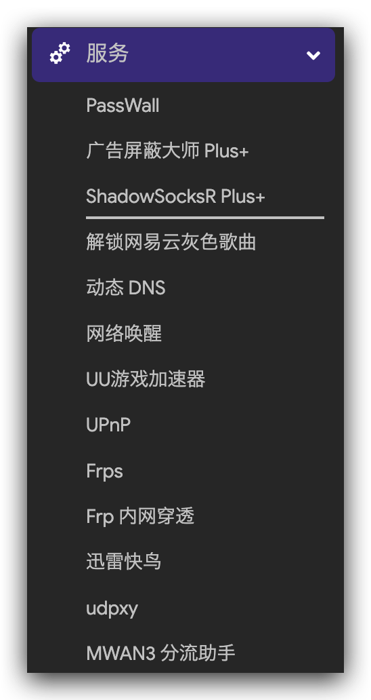

在上边栏中选择 **服务器节点**。
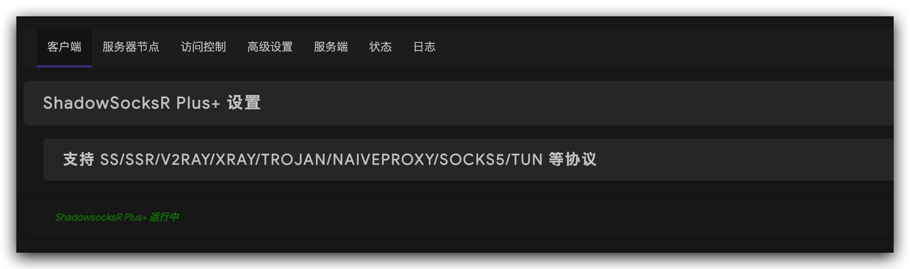

输入订阅链接。

先更新订阅列表，再点击更新服务器节点。
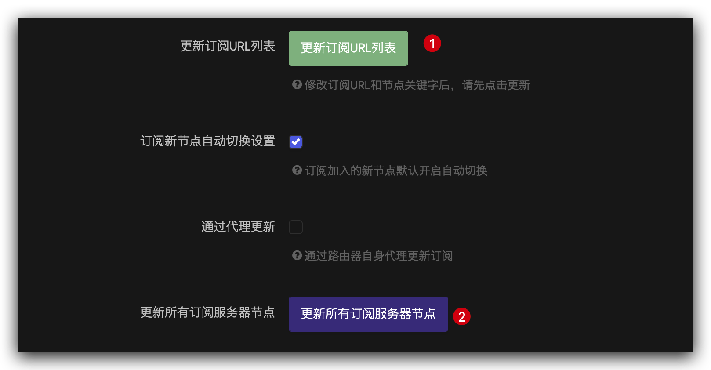

回到 **客户端** ，在主服务器中随意选择一个节点，其他与图中保持一致即可，点击保存并应用，等待一段时间即可生效。
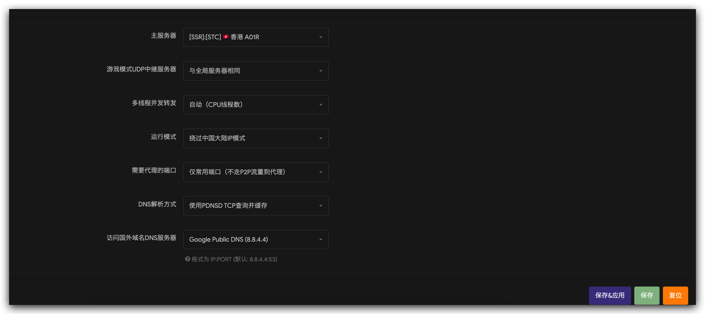