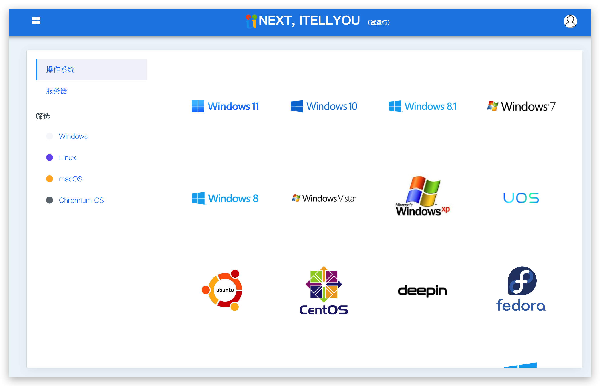
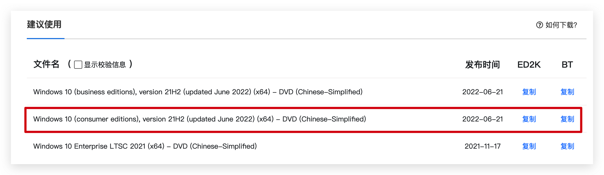
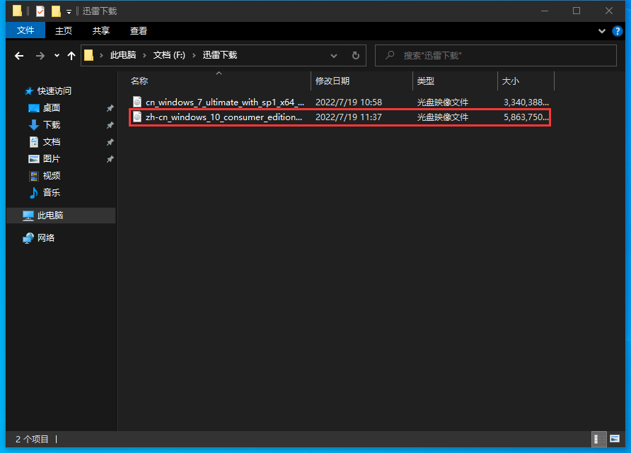
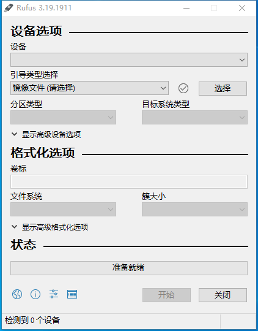
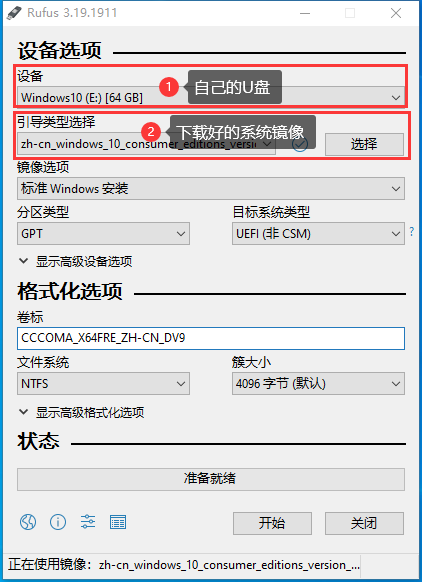

# 电脑系统重装指南

电脑系统重装有许多方法，最常见的是使用专门的软件重装系统，但笔者在使用各类重装软件重装系统后发现，这些软件或多或少都会捆绑一些杂七杂八的软件，并非我们所愿。
因此，为了能安装完全纯净的系统，便有了此教程。

## 下载系统镜像

首先，我们先要下载官方原装的系统镜像。我们去到 [ITELLYOU](https://next.itellyou.cn/) 下载。
根据自己需要选择一个镜像下载下来。在这里我以 Windows10 举例。

进入 Windows10 下载界面。复制 `consumer editions` 链接中的任意一个，然后打开迅雷进行下载。

下载完成后，你会在你选择的保存路径中看到下载好的镜像文件。

到这里，我们第一步就已经完成了，接下来我们要制作一个启动U盘。

## 启动U盘制作

制作启动U盘有许多软件可以使用，在这里我推荐使用 [Rufus](https://rufus.ie/zh/)。
我们去到 Rufus 官网将其下载下来。以下就是该软件的界面。

我们插入一个大于 8GB 的U盘作为启动U盘。
> 在这里要注意，启动U盘制作的过程中，将会对U盘进行格式化，所以有必要的话请对U盘文件进行备份。

设备一栏就是自己的U盘，软件会自动检测。
在引导类型选择一栏请选择我们刚下载好的系统镜像。
分区类型，如果自己电脑是最新两年出的，请选择 `GPT`，如果电脑比较久请选择 `MBR`。
其他项保持不变即可，然后点击开始。

等待状态进度条完成，我们的启动U盘就制作完成了。

## 开始重装

重启电脑，进入 `BIOS` 界面，选择U盘启动。
> 根据电脑主板不同，进入 `BIOS` 方法各异，如果你不懂如何进入 `BIOS` 请自行百度。

选择U盘启动后，接下来就按照提示安装系统即可。
> 在安装过程中，如果你想将系统安装在其他盘符中，请选择自定义安装，之后选择自己的盘符即可。

## 写在最后

到这里系统重装基本完成了，如果你在重装过程中遇到任何问题，可以给我发邮件或者加我的 QQ 。
> 我的邮箱：9186256@gmail.com
> 我的 QQ ：9186256