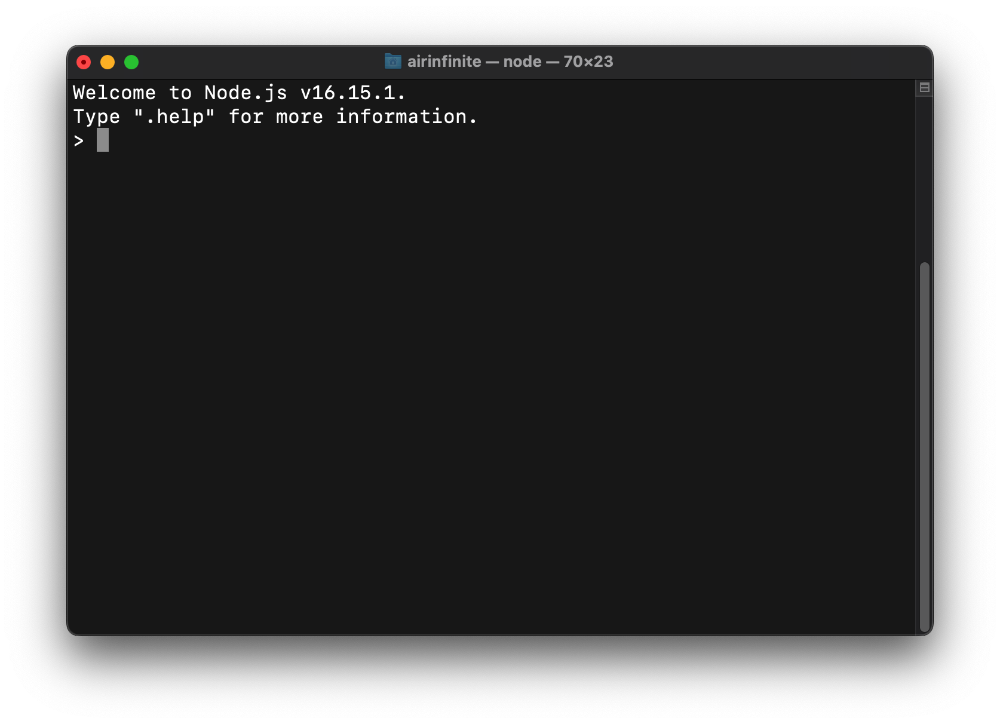

# Hexo 安装指南

## 安装
___
### 安装前的准备

在正式安装 Hexo 前，需要保证电脑中已经提前安装好以下程序：
* Node.js
* Git

在此之前，我们已经对安装 Git 做了详细的教程，这里仅演示如何安装 Node.js。


### 安装 Node.js

> 为了避免之后在全局安装 Hexo 时出现 `EACCES` 权限错误，我们使用 nvm 安装 Node.js。

在终端运行如下代码：
```
curl -o- https://raw.githubusercontent.com/nvm-sh/nvm/v0.39.1/install.sh | bash
```
将如下代码添加到配置文件（`~/.bash_profile`，`~/.zshrc`，`~/.profile`，or `~/.bashrc`）中：
```
export NVM_DIR="$([ -z "${XDG_CONFIG_HOME-}" ] && printf %s "${HOME}/.nvm" || printf %s "${XDG_CONFIG_HOME}/nvm")"
[ -s "$NVM_DIR/nvm.sh" ] && \. "$NVM_DIR/nvm.sh" # This loads nvm
```
> 针对 macOS 来说，如果在根目录下找不到配置文件，就自行创建一个配置文件，在这里我创建的是 `.zshrc` 文件。

在终端运行如下代码检验是否成功安装 nvm：
```
command -v nvm
```

在 nvm 安装好之后，运行如下代码安装 Node.js：
```
nvm install v16.15.1
```
> 这里安装的是 16.15.1 版本的 Node.js，你也可以根据需要安装其他版本。

在终端输入 `node` 后，若出现如下提示，表明安装成功。



### 安装 Hexo

在所有必备程序安装好之后，即可以使用 npm 安装 Hexo。
```
npm install -g hexo-cli
```

到这里，Hexo 就已经安装完成了。如何利用 Hexo 创建博客， Hexo 的官方文档已经极其详尽了。在这里就不再赘述，更加详细的内容请移步 [Hexo 官方文档](https://hexo.io/zh-cn/docs/)。